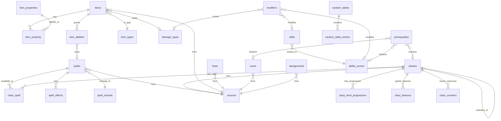

# D&D 5e Compendium Database Schema Design

**Date:** 2025-11-17
**Status:** Approved
**Database:** PostgreSQL/MySQL (Laravel compatible)

## Overview

This document defines the relational database schema for importing and managing D&D 5th Edition content from XML files into a searchable, queryable compendium. The schema supports multiple sourcebooks, handles complex relationships between game elements, and follows Laravel ORM conventions.

## Design Goals

1. **Multi-sourcebook support** - Import content from PHB, XGE, DMG, and future sourcebooks with proper tracking
2. **Balanced normalization** - Normalize key relationships (spell-to-class, item-to-type) while keeping simple data straightforward
3. **Structured data extraction** - Parse structured fields (classes, prerequisites, components) but leave narrative text as-is
4. **Query flexibility** - Enable efficient queries like "all spells for Wizard class" or "items with Finesse property"
5. **Laravel compatibility** - Follow Laravel naming conventions and best practices for Eloquent ORM

## Key Design Decisions

### 1. Normalization Strategy
- **Approach:** Entity-centric with selective normalization
- **Rationale:** Balances query performance with maintainability
- Core entities (spells, items, feats) get dedicated tables
- Frequently-queried codes (schools, damage types) are lookup tables
- Many-to-many relationships use junction tables

### 2. Plain-Text Reference Extraction

**Extract from structured fields only:**
- Spell classes: `"Fighter (Eldritch Knight), Sorcerer"` → parsed into `class_spell` junction table
- Spell components: `"V, S, M (a sapphire worth 1,000 gp)"` → parsed into component columns
- Ability scores: `"Str +2, Cha +1"` → parsed into `modifiers` table
- Prerequisites: `"Dexterity 13 or higher"` → structured in `prerequisites` table
- Item properties: `"V,M,A"` codes → `item_property` junction table

**Leave as narrative text:**
- Spell/item/feat descriptions remain as-is
- Embedded references to conditions, spells, items stay in description text
- No NLP/complex parsing needed for import

### 3. Universal Polymorphic Tables

Instead of separate `race_traits`, `background_traits`, `class_traits`, we use:
- **`traits`** table with `reference_type` and `reference_id`
- **`proficiencies`** table with `reference_type` and `reference_id`
- **`modifiers`** table with `reference_type` and `reference_id`
- **`prerequisites`** table with `reference_type` and `reference_id`

**Benefits:**
- Easier to display "all traits for a character" (race + background + class)
- Single query to get all proficiencies regardless of source
- Reduces schema complexity (4 tables instead of 12+)

### 4. Spell Scaling System

The `spell_effects` table handles both:
- **Cantrip scaling** (character level 5/11/17): `scaling_type = 'character_level'`
- **Upcasting** (higher spell slots): `scaling_type = 'spell_slot_level'`
- **Multiple effect types**: damage, healing, duration, targets, range

Example: "Aid" cast at 3rd level adds +5 hp per slot level above 2nd.

### 5. Spell Component Parsing

Spell components are parsed from XML into structured columns:
- **Component flags**: `has_verbal_component`, `has_somatic_component`, `has_material_component`
- **Material details**: `material_description`, `material_cost_gp`, `material_consumed`

**Parsing from XML:**
```xml
<components>V, S, M (a sapphire worth 1,000 gp)</components>
```
Becomes:
```
has_verbal_component = true
has_somatic_component = true
has_material_component = true
material_description = "a sapphire"
material_cost_gp = 1000
material_consumed = false (determined by spell text)
```

**Benefits:**
- Simple SQL queries: `WHERE material_cost_gp <= :character_gold`
- Easy filtering: "Show spells I can cast without materials"
- Cost tracking: "Does this spell consume expensive components?"

**Regex patterns for parsing:**
- Component flags: Split by comma, check for 'V', 'S', 'M'
- Material description: `M \((.*?)\)` → extract text in parentheses
- Material cost: `worth (\d+(?:,\d+)*) gp` → extract numeric value
- Consumed: Check spell description for keywords like "consumed", "which the spell consumes"

### 6. Magic Item Charges

Items can have:
- **Charges**: `max_charges`, `recharge_formula` ("1d6+4"), `recharge_timing` ("at dawn")
- **Abilities**: Spell-casting, special features, consumable effects via `item_abilities` table
- Each ability can cost charges and have usage limits

### 7. Magic Item Attunement

Magic items track attunement requirements:
- **Attunement flag**: `requires_attunement` (boolean)
- **Restrictions**: `attunement_requirement` (text, nullable)

**Examples:**
```
Staff of Power:
  requires_attunement = true
  attunement_requirement = "by a sorcerer, warlock, or wizard"

Holy Avenger:
  requires_attunement = true
  attunement_requirement = "by a paladin"

+1 Longsword:
  requires_attunement = false
  attunement_requirement = null
```

**Parsing from item descriptions:**
- Check for text "requires attunement" → `requires_attunement = true`
- If followed by "by [restriction]" → extract to `attunement_requirement`
- No mention or "no attunement required" → `requires_attunement = false`

**Benefits:**
- Simple queries: `WHERE requires_attunement = false` (no attunement slot needed)
- Display restrictions: Show "Requires attunement by a wizard" in item details
- Character validation: Check if character meets attunement requirements

### 8. Class Hierarchy

Single `classes` table with self-referencing `parent_class_id`:
- Base classes: `parent_class_id = NULL`
- Subclasses: `parent_class_id = {base_class_id}`

**Example:**
- Fighter (id=1, parent_class_id=NULL)
- Eldritch Knight (id=15, parent_class_id=1)

### 9. Laravel Conventions Applied

- ✅ Plural table names (`spells`, `items`, `feats`)
- ✅ Junction tables in alphabetical order (`class_spell`, `item_property`)
- ✅ Foreign keys as `{table}_id` (singular)
- ✅ Composite PKs for pure junction tables (no surrogate `id`)
- ✅ Indexes on foreign keys and common query fields
- ❌ No timestamps (`created_at`, `updated_at`) - not needed for static compendium data
- ❌ No soft deletes (`deleted_at`) - hard deletes only

---

## Complete Schema

### Core Entity Tables (10)

#### **spells**
Primary game spell data.

| Column | Type | Constraints | Description |
|--------|------|-------------|-------------|
| id | integer | PK | |
| name | text | | Spell name |
| level | integer | | 0-9 (0 = cantrip) |
| school_id | integer | FK → spell_schools | |
| is_ritual | boolean | | Can be cast as ritual |
| needs_concentration | boolean | | Requires concentration |
| casting_time | text | | "1 action", "1 bonus action", "1 minute" |
| range | text | | "60 feet", "Self", "Touch" |
| has_verbal_component | boolean | | V component required |
| has_somatic_component | boolean | | S component required |
| has_material_component | boolean | | M component required |
| material_description | text | nullable | Description of material component |
| material_cost_gp | decimal | nullable | Cost of material in gold pieces |
| material_consumed | boolean | default false | Whether spell consumes the material |
| duration | text | | "Concentration, up to 1 minute", "Instantaneous" |
| description | text | | Full spell description |
| source_id | integer | FK → sources | Sourcebook reference |
| source_pages | text | nullable | Page numbers "148", "148, 150", "211-213" |

**Indexes:** `school_id`, `level`, `source_id`, `material_cost_gp`

#### **items**
Weapons, armor, gear, magic items.

| Column | Type | Constraints | Description |
|--------|------|-------------|-------------|
| id | integer | PK | |
| name | text | | Item name |
| item_type_id | integer | FK → item_types | |
| is_magic_item | boolean | | Distinguishes mundane from magic |
| rarity | text | | "common", "uncommon", "rare", "very rare", "legendary", "artifact" |
| weight | decimal | nullable | In pounds |
| value_gp | decimal | nullable | Value in gold pieces |
| armor_class | integer | nullable | For armor |
| damage_dice_1 | text | nullable | Base damage (e.g., "1d8") |
| damage_dice_2 | text | nullable | Versatile damage (e.g., "1d10") |
| damage_type_id | integer | FK → damage_types, nullable | |
| range | text | nullable | "25/100" format |
| strength_requirement | integer | nullable | For heavy armor |
| has_stealth_disadvantage | boolean | | For heavy armor |
| max_charges | integer | nullable | For magic items |
| recharge_formula | text | nullable | "1d6+4", "all" |
| recharge_timing | text | nullable | "at dawn", "never", "per day" |
| requires_attunement | boolean | default false | Does this item require attunement |
| attunement_requirement | text | nullable | Attunement restriction (e.g., "by a wizard") |
| description | text | | Full item description |
| source_id | integer | FK → sources | |
| source_pages | text | nullable | Page numbers |

**Indexes:** `item_type_id`, `is_magic_item`, `requires_attunement`, `source_id`

#### **feats**
Character feats.

| Column | Type | Constraints | Description |
|--------|------|-------------|-------------|
| id | integer | PK | |
| name | text | | Feat name |
| description | text | | Full feat description |
| source_id | integer | FK → sources | |
| source_pages | text | nullable | Page numbers |

**Indexes:** `source_id`

#### **races**
Player character races.

| Column | Type | Constraints | Description |
|--------|------|-------------|-------------|
| id | integer | PK | |
| name | text | | Race name (e.g., "Dragonborn", "Elf, Wood") |
| size | char | | 'S', 'M', 'L' |
| speed | integer | | Base walking speed in feet |
| description | text | | Full race description |
| source_id | integer | FK → sources | |
| source_pages | text | nullable | Page numbers |

**Indexes:** `source_id`

#### **backgrounds**
Character backgrounds.

| Column | Type | Constraints | Description |
|--------|------|-------------|-------------|
| id | integer | PK | |
| name | text | | Background name (e.g., "Acolyte") |
| description | text | | Full background description |
| source_id | integer | FK → sources | |
| source_pages | text | nullable | Page numbers |

**Indexes:** `source_id`

#### **classes**
Character classes and subclasses (self-referencing).

| Column | Type | Constraints | Description |
|--------|------|-------------|-------------|
| id | integer | PK | |
| name | text | | Class/subclass name |
| parent_class_id | integer | FK → classes, nullable | NULL = base class, not NULL = subclass |
| hit_dice | integer | nullable | Hit die size (6, 8, 10, 12) |
| num_skill_choices | integer | nullable | Number of skills to choose |
| available_skills | text | nullable | Comma-separated skill names player can choose from |
| starting_wealth | text | nullable | Dice formula like "5d4x10" |
| spellcasting_ability | text | nullable | "Intelligence", "Wisdom", "Charisma" for spellcasters |
| spell_slots_reset | char(1) | nullable | 'L' = long rest, 'S' = short rest |
| description | text | | Full class description |
| source_id | integer | FK → sources | |
| source_pages | text | nullable | Page numbers |

**Indexes:** `parent_class_id`, `source_id`

#### **monsters**
Creature stat blocks for encounters and reference.

| Column | Type | Constraints | Description |
|--------|------|-------------|-------------|
| id | integer | PK | |
| name | text | | Monster name |
| sortname | text | nullable | For alphabetical sorting |
| size | char | | 'T', 'S', 'M', 'L', 'H', 'G' |
| type | text | | "humanoid (aarakocra)", "aberration" |
| alignment | text | | "Neutral Good", "Lawful Evil" |
| armor_class | integer | | Base AC value |
| armor_type | text | nullable | "natural armor", "plate" |
| hit_points_avg | integer | | Average hit points |
| hit_points_formula | text | | Dice formula "18d10+36" |
| speed | text | | "walk 20 ft., fly 50 ft." |
| strength | integer | | Strength score |
| dexterity | integer | | Dexterity score |
| constitution | integer | | Constitution score |
| intelligence | integer | | Intelligence score |
| wisdom | integer | | Wisdom score |
| charisma | integer | | Charisma score |
| saving_throws | text | nullable | "Con +6, Int +8, Wis +6" |
| skills | text | nullable | "History +12, Perception +10" |
| passive_perception | integer | | Passive Perception score |
| damage_vulnerabilities | text | nullable | Comma-separated damage types |
| damage_resistances | text | nullable | Comma-separated damage types |
| damage_immunities | text | nullable | Comma-separated damage types |
| condition_immunities | text | nullable | Comma-separated conditions |
| senses | text | nullable | "darkvision 120 ft., tremorsense 60 ft." |
| languages | text | | "Common, Draconic, telepathy 120 ft." |
| challenge_rating | text | | "1/4", "10", "21" |
| is_npc | boolean | default false | NPC flag from XML |
| ancestry | text | nullable | For variant monsters |
| environment | text | nullable | "mountain", "underwater", "forest" |
| description | text | | Full lore and description |
| source_id | integer | FK → sources | |
| source_pages | text | nullable | Page numbers |

**Indexes:** `size`, `type`, `challenge_rating`, `environment`, `source_id`

#### **class_level_progression**
Spell slot progression per class level.

| Column | Type | Constraints | Description |
|--------|------|-------------|-------------|
| id | integer | PK | |
| class_id | integer | FK → classes | |
| level | integer | | 1-20 |
| cantrips_known | integer | nullable | Number of cantrips (0 or null for non-casters) |
| spell_slots_1st | integer | nullable | 1st level spell slots |
| spell_slots_2nd | integer | nullable | 2nd level spell slots |
| spell_slots_3rd | integer | nullable | 3rd level spell slots |
| spell_slots_4th | integer | nullable | 4th level spell slots |
| spell_slots_5th | integer | nullable | 5th level spell slots |
| spell_slots_6th | integer | nullable | 6th level spell slots |
| spell_slots_7th | integer | nullable | 7th level spell slots |
| spell_slots_8th | integer | nullable | 8th level spell slots |
| spell_slots_9th | integer | nullable | 9th level spell slots |

**Indexes:** `class_id`, `level`
**Unique Constraint:** `(class_id, level)`

**Parsing from XML:** `<autolevel level="5"><slots>2,4,2</slots></autolevel>` becomes `level=5, cantrips_known=2, spell_slots_1st=4, spell_slots_2nd=2`

#### **class_features**
Features gained at each class level.

| Column | Type | Constraints | Description |
|--------|------|-------------|-------------|
| id | integer | PK | |
| class_id | integer | FK → classes | Can be base class or subclass |
| level | integer | | 1-20 |
| feature_name | text | | "Spellcasting", "Magical Tinkering", "Extra Attack" |
| is_optional | boolean | default false | True for optional features (multiclass, variant rules) |
| description | text | | Full feature text |
| sort_order | integer | | Display order for multiple features at same level |

**Indexes:** `class_id`, `level`, `is_optional`

**Example - Artificer level 1:**
- `class_id=5, level=1, feature_name="Magical Tinkering", is_optional=false`
- `class_id=5, level=1, feature_name="Spellcasting", is_optional=false`
- `class_id=5, level=1, feature_name="Starting Artificer", is_optional=true` (starting equipment)
- `class_id=5, level=1, feature_name="Multiclass Artificer", is_optional=true` (multiclass rules)

#### **class_counters**
Resource tracking that scales with class level.

| Column | Type | Constraints | Description |
|--------|------|-------------|-------------|
| id | integer | PK | |
| class_id | integer | FK → classes | |
| level | integer | | 1-20 |
| counter_name | text | | "Spells Known", "Rage Uses", "Ki Points", "Defensive Field" |
| counter_value | integer | | The numeric value at this level |
| reset_timing | char(1) | nullable | 'L' = long rest, 'S' = short rest, null = doesn't reset |

**Indexes:** `class_id`, `level`, `counter_name`

**Example - Ranger Spells Known:**
- `class_id=8, level=2, counter_name="Spells Known", counter_value=2, reset_timing=null`
- `class_id=8, level=3, counter_name="Spells Known", counter_value=3, reset_timing=null`

**Example - Artificer Defensive Field:**
- `class_id=5, level=3, counter_name="Defensive Field", counter_value=2, reset_timing='L'`

---

### Lookup / Reference Tables (7)

#### **spell_schools**
Magic school classifications.

| Column | Type | Constraints | Description |
|--------|------|-------------|-------------|
| id | integer | PK | |
| code | char | UNIQUE | 'C', 'EN', 'EV', 'A', 'T', 'I', 'N', 'D' |
| name | text | | 'Conjuration', 'Enchantment', 'Evocation', etc. |

**Seed Data:** Abjuration, Conjuration, Divination, Enchantment, Evocation, Illusion, Necromancy, Transmutation

#### **damage_types**
Damage type classifications.

| Column | Type | Constraints | Description |
|--------|------|-------------|-------------|
| id | integer | PK | |
| code | char | UNIQUE | 'S', 'P', 'B', 'F', 'C', 'L', 'T', 'A', 'N', 'R', 'PS', 'FO' |
| name | text | | 'Slashing', 'Piercing', 'Bludgeoning', etc. |

**Seed Data:** Slashing, Piercing, Bludgeoning, Fire, Cold, Lightning, Thunder, Acid, Necrotic, Radiant, Psychic, Force

#### **item_types**
Item category classifications.

| Column | Type | Constraints | Description |
|--------|------|-------------|-------------|
| id | integer | PK | |
| code | text | UNIQUE | 'M', 'R', 'A', 'LA', 'MA', 'HA', 'S', 'G', 'T', 'W' |
| name | text | | 'Melee Weapon', 'Ranged Weapon', etc. |
| category | text | | 'weapon', 'armor', 'gear', 'magic' |

**Indexes:** `category`

#### **item_properties**
Weapon/armor property flags.

| Column | Type | Constraints | Description |
|--------|------|-------------|-------------|
| id | integer | PK | |
| code | text | UNIQUE | 'V', 'M', 'A', 'LD', 'F', 'H', 'L', 'R', 'T', '2H', 'S' |
| name | text | | 'Versatile', 'Martial', 'Ammunition', etc. |
| description | text | | Property rules text |

#### **ability_scores**
The six core ability scores.

| Column | Type | Constraints | Description |
|--------|------|-------------|-------------|
| id | integer | PK | |
| code | text | UNIQUE | 'STR', 'DEX', 'CON', 'INT', 'WIS', 'CHA' |
| name | text | | 'Strength', 'Dexterity', etc. |

**Seed Data:** Strength, Dexterity, Constitution, Intelligence, Wisdom, Charisma

#### **skills**
The 18 core skills.

| Column | Type | Constraints | Description |
|--------|------|-------------|-------------|
| id | integer | PK | |
| name | text | | Skill name |
| ability_score_id | integer | FK → ability_scores | Which ability the skill uses |

**Indexes:** `ability_score_id`

**Seed Data:** Acrobatics (DEX), Animal Handling (WIS), Arcana (INT), Athletics (STR), Deception (CHA), History (INT), Insight (WIS), Intimidation (CHA), Investigation (INT), Medicine (WIS), Nature (INT), Perception (WIS), Performance (CHA), Persuasion (CHA), Religion (INT), Sleight of Hand (DEX), Stealth (DEX), Survival (WIS)

#### **sources**
Sourcebook tracking.

| Column | Type | Constraints | Description |
|--------|------|-------------|-------------|
| id | integer | PK | |
| code | text | UNIQUE | 'PHB', 'XGE', 'DMG', 'SCAG', etc. |
| name | text | | Full sourcebook name |
| publisher | text | | 'Wizards of the Coast', 'Kobold Press', etc. |
| publication_year | integer | | 2014, 2017, 2020, 2024, etc. |
| edition | text | | '5e', '2024' |

**Indexes:** `edition`, `publisher`

---

### Junction / Relationship Tables (14)

#### **class_spell** (pure junction)
Which classes can cast which spells.

| Column | Type | Constraints | Description |
|--------|------|-------------|-------------|
| class_id | integer | FK → classes, PK | Can be base class or subclass |
| spell_id | integer | FK → spells, PK | |

**Composite PK:** `(class_id, spell_id)`
**Indexes:** `spell_id` (for reverse lookups)

#### **item_property** (pure junction)
Which properties apply to which items.

| Column | Type | Constraints | Description |
|--------|------|-------------|-------------|
| item_id | integer | FK → items, PK | |
| property_id | integer | FK → item_properties, PK | |

**Composite PK:** `(item_id, property_id)`
**Indexes:** `property_id` (for reverse lookups)

#### **spell_effects**
Spell damage, healing, and scaling effects.

| Column | Type | Constraints | Description |
|--------|------|-------------|-------------|
| id | integer | PK | |
| spell_id | integer | FK → spells | |
| effect_type | text | | 'damage', 'healing', 'duration', 'targets', 'range', 'other' |
| description | text | | "Acid Damage", "Duration", "Number of Targets" |
| dice_formula | text | nullable | "1d6", "3d8+%0" (%0 = spellcasting ability mod) |
| base_value | text | nullable | "1 minute", "3 targets" |
| scaling_type | text | | 'character_level', 'spell_slot_level', 'none' |
| min_character_level | integer | nullable | 0 for base, 5/11/17 for cantrip scaling |
| min_spell_slot | integer | nullable | Spell slot level for upcasting |
| scaling_increment | text | nullable | "+1d8 per slot", "+5 hp per slot" |

**Indexes:** `spell_id`, `effect_type`, `scaling_type`

**Example - Acid Splash (cantrip scaling):**
```
spell_id=1, effect_type='damage', dice_formula='1d6', scaling_type='character_level', min_character_level=0
spell_id=1, effect_type='damage', dice_formula='2d6', scaling_type='character_level', min_character_level=5
spell_id=1, effect_type='damage', dice_formula='3d6', scaling_type='character_level', min_character_level=11
spell_id=1, effect_type='damage', dice_formula='4d6', scaling_type='character_level', min_character_level=17
```

**Example - Aid (upcasting):**
```
spell_id=5, effect_type='healing', base_value='5', scaling_type='spell_slot_level', min_spell_slot=2
spell_id=5, effect_type='healing', base_value='10', scaling_type='spell_slot_level', min_spell_slot=3, scaling_increment='+5 per slot'
```

#### **item_abilities**
Magic item spells and special abilities.

| Column | Type | Constraints | Description |
|--------|------|-------------|-------------|
| id | integer | PK | |
| item_id | integer | FK → items | |
| ability_type | text | | 'spell', 'feature', 'consumable' |
| spell_id | integer | FK → spells, nullable | If ability_type='spell' |
| name | text | | For non-spell abilities |
| description | text | | Ability description |
| charges_cost | integer | nullable | How many charges this ability costs |
| usage_limit | text | nullable | "once per day", "3 charges", "at will" |
| save_dc | integer | nullable | For abilities requiring saves |
| attack_bonus | integer | nullable | For abilities making attacks |
| sort_order | integer | | Display order |

**Indexes:** `item_id`, `spell_id`, `ability_type`

**Example - Staff of Fire:**
```
item_id=50, ability_type='spell', spell_id=123, charges_cost=1, usage_limit='at will'  // Fire Bolt
item_id=50, ability_type='spell', spell_id=456, charges_cost=3, usage_limit=NULL  // Fireball
item_id=50, ability_type='feature', name='Fire Immunity', charges_cost=NULL
```

#### **modifiers** (polymorphic)
Universal modifier system for ability scores, skills, AC, speed, etc.

| Column | Type | Constraints | Description |
|--------|------|-------------|-------------|
| id | integer | PK | |
| reference_type | text | | 'feat', 'race', 'item', 'class', 'background', 'spell' |
| reference_id | integer | | Polymorphic reference to source |
| modifier_category | text | | 'ability_score', 'skill', 'speed', 'initiative', 'armor_class', 'damage_resistance', 'saving_throw' |
| ability_score_id | integer | FK → ability_scores, nullable | If modifying ability score |
| skill_id | integer | FK → skills, nullable | If modifying skill |
| damage_type_id | integer | FK → damage_types, nullable | If granting resistance |
| value | text | | '+1', '+2', '+5', '+10 feet', 'advantage', 'proficiency' |
| condition | text | nullable | "while wearing armor", "against magic" |

**Indexes:** `(reference_type, reference_id)`, `modifier_category`

**Example - Feat "Actor" (+1 Charisma):**
```
reference_type='feat', reference_id=5, modifier_category='ability_score', ability_score_id=6, value='+1'
```

**Example - Race "Dragonborn" (Fire Resistance):**
```
reference_type='race', reference_id=2, modifier_category='damage_resistance', damage_type_id=4, value='resistance'
```

#### **prerequisites** (polymorphic)
Universal prerequisite system.

| Column | Type | Constraints | Description |
|--------|------|-------------|-------------|
| id | integer | PK | |
| reference_type | text | | 'feat', 'spell', 'class', 'multiclass' |
| reference_id | integer | | Polymorphic reference |
| prerequisite_type | text | | 'ability_score', 'level', 'race', 'class', 'proficiency', 'other' |
| ability_score_id | integer | FK → ability_scores, nullable | |
| minimum_value | integer | nullable | Minimum score required |
| race_id | integer | FK → races, nullable | |
| class_id | integer | FK → classes, nullable | |
| required_level | integer | nullable | Character level |
| description | text | nullable | For complex prerequisites |

**Indexes:** `(reference_type, reference_id)`, `prerequisite_type`

**Example - Feat "Defensive Duelist" (requires Dexterity 13):**
```
reference_type='feat', reference_id=10, prerequisite_type='ability_score', ability_score_id=2, minimum_value=13
```

#### **traits** (polymorphic)
Universal traits system (replaces race_traits, background_traits, class_traits).

| Column | Type | Constraints | Description |
|--------|------|-------------|-------------|
| id | integer | PK | |
| reference_type | text | | 'race', 'background', 'class' |
| reference_id | integer | | Polymorphic reference |
| name | text | | Trait name |
| category | text | nullable | 'species', 'subspecies', 'description', 'feature' |
| description | text | | Full trait text |
| sort_order | integer | | Display order |

**Indexes:** `(reference_type, reference_id)`, `category`

**Example - Race "Elf, High" (Darkvision):**
```
reference_type='race', reference_id=8, name='Darkvision', category='species', description='You can see in dim light...', sort_order=1
```

#### **proficiencies** (polymorphic)
Universal proficiencies system.

| Column | Type | Constraints | Description |
|--------|------|-------------|-------------|
| id | integer | PK | |
| reference_type | text | | 'race', 'background', 'class', 'feat' |
| reference_id | integer | | Polymorphic reference |
| proficiency_type | text | | 'skill', 'weapon', 'armor', 'tool', 'language', 'saving_throw' |
| skill_id | integer | FK → skills, nullable | |
| item_id | integer | FK → items, nullable | For weapon/armor proficiencies |
| ability_score_id | integer | FK → ability_scores, nullable | For saving throws |
| proficiency_name | text | nullable | For free-form like "Elvish" or "one artisan tool" |

**Indexes:** `(reference_type, reference_id)`, `proficiency_type`

**Example - Background "Acolyte" (Insight skill):**
```
reference_type='background', reference_id=1, proficiency_type='skill', skill_id=7
```

**Example - Race "Elf, Wood" (Longbow weapon):**
```
reference_type='race', reference_id=9, proficiency_type='weapon', item_id=45
```

#### **random_tables**
Extractable dice tables for backgrounds, classes, races.

| Column | Type | Constraints | Description |
|--------|------|-------------|-------------|
| id | integer | PK | |
| reference_type | text | | 'background', 'class', 'race' |
| reference_id | integer | | Polymorphic reference |
| table_name | text | | 'Personality Trait', 'Ideal', 'Bond', 'Flaw', 'Treasured Item' |
| dice_type | text | | 'd6', 'd8', 'd10', 'd100' |
| description | text | nullable | Optional context |

**Indexes:** `(reference_type, reference_id)`

#### **random_table_entries**
Individual entries for random tables.

| Column | Type | Constraints | Description |
|--------|------|-------------|-------------|
| id | integer | PK | |
| random_table_id | integer | FK → random_tables | |
| roll_value | text | | '1', '2', '01-10' (for d100 ranges) |
| result | text | | The actual table entry text |
| sort_order | integer | | Display order |

**Indexes:** `random_table_id`, `sort_order`

**Example - Background "Acolyte" Personality Traits (d8):**
```
random_table: reference_type='background', reference_id=1, table_name='Personality Trait', dice_type='d8'
entries:
  roll_value='1', result='I idolize a particular hero of my faith...', sort_order=1
  roll_value='2', result='I can find common ground between the fiercest enemies...', sort_order=2
  ...
```

#### **monster_traits**
Monster special abilities and features.

| Column | Type | Constraints | Description |
|--------|------|-------------|-------------|
| id | integer | PK | |
| monster_id | integer | FK → monsters | |
| name | text | | "Dive Attack", "Amphibious", "Pack Tactics" |
| description | text | | Full trait description |
| attack_data | text | nullable | Raw attack string "Dive Attack||1d6" |
| sort_order | integer | | Display order |

**Indexes:** `monster_id`

#### **monster_actions**
Monster actions and reactions.

| Column | Type | Constraints | Description |
|--------|------|-------------|-------------|
| id | integer | PK | |
| monster_id | integer | FK → monsters | |
| action_type | text | | 'action', 'reaction', 'bonus_action' |
| name | text | | "Multiattack", "Tentacle", "Parry" |
| description | text | | Full action description |
| attack_data | text | nullable | "Bludgeoning Damage|+9|2d6+5" |
| recharge | text | nullable | "3/DAY", "5-6", "Recharge after Short Rest" |
| sort_order | integer | | Display order |

**Indexes:** `monster_id`, `action_type`

#### **monster_legendary_actions**
Monster legendary and lair actions.

| Column | Type | Constraints | Description |
|--------|------|-------------|-------------|
| id | integer | PK | |
| monster_id | integer | FK → monsters | |
| name | text | | "Detect", "Tail Swipe", "Legendary Actions (3/Turn)" |
| description | text | | Full action description |
| action_cost | integer | default 1 | Costs 1, 2, or 3 legendary actions |
| is_lair_action | boolean | default false | True if this is a lair action |
| attack_data | text | nullable | "Psychic Damage||3d6" |
| recharge | text | nullable | "3/TURN" |
| sort_order | integer | | Display order |

**Indexes:** `monster_id`, `is_lair_action`

#### **monster_spellcasting**
Monster innate spellcasting abilities.

| Column | Type | Constraints | Description |
|--------|------|-------------|-------------|
| id | integer | PK | |
| monster_id | integer | FK → monsters | |
| description | text | | Full spellcasting ability text |
| spell_slots | text | nullable | Comma-separated slot counts "0,4,3,3,3,2,1,1,1,1" |
| spellcasting_ability | text | nullable | "Charisma", "Intelligence", "Wisdom" |
| spell_save_dc | integer | nullable | Spell save DC |
| spell_attack_bonus | integer | nullable | Spell attack modifier |

**Indexes:** `monster_id`

#### **monster_spells**
Junction table for monster spells.

| Column | Type | Constraints | Description |
|--------|------|-------------|-------------|
| monster_id | integer | FK → monsters, PK | |
| spell_id | integer | FK → spells, PK | |
| usage_type | text | PK | 'at_will', '1/day', '3/day', 'slot' |
| usage_limit | text | nullable | "1/day", "3/day each" |

**Composite PK:** `(monster_id, spell_id, usage_type)`
**Indexes:** `spell_id`

---

## Entity Relationship Diagram



---

## Import Workflow

### 1. Seed Lookup Tables
Populate static reference data first:
- `spell_schools` (8 schools)
- `damage_types` (12 types)
- `ability_scores` (6 abilities)
- `skills` (18 skills)
- `item_types`, `item_properties` (from XML analysis)
- `sources` (add sourcebooks as needed)

### 2. Import Core Entities
For each XML file:
- Parse `<spell>`, `<item>`, `<feat>`, `<race>`, `<background>`, `<class>` elements
- Insert into respective core entity tables
- Track inserted IDs for relationship building

### 3. Parse and Link Relationships

**Spells:**
- Parse `<classes>` field → insert into `class_spell`
- Parse `<roll>` elements → insert into `spell_effects`
- Parse `<components>` → store as JSONB

**Items:**
- Parse `<property>` codes → insert into `item_property`
- Extract weapon/armor data → populate item columns

**Feats:**
- Parse `<modifier>` elements → insert into `modifiers`
- Parse `<prerequisite>` → insert into `prerequisites`

**Races:**
- Parse `<ability>` text → insert into `modifiers`
- Parse `<trait>` elements → insert into `traits`
- Parse `<proficiency>`, `<weapons>` → insert into `proficiencies`

**Backgrounds:**
- Parse `<proficiency>` → insert into `proficiencies`
- Parse `<trait>` elements → insert into `traits` and `random_tables`
- Extract dice tables from trait text → insert into `random_table_entries`

**Classes:**
- Parse class base attributes → populate `classes` table columns
- Parse `<armor>`, `<weapons>`, `<tools>` → insert into `proficiencies`
- Parse `<autolevel>` elements per level 1-20:
  - `<slots>` → insert into `class_level_progression`
  - `<feature>` → insert into `class_features`
  - `<counter>` → insert into `class_counters`
- Parse multiclass requirements → insert into `prerequisites`

**Monsters:**
- Parse `<trait>` → insert into `monster_traits`
- Parse `<action>`, `<reaction>` → insert into `monster_actions`
- Parse `<legendary>` → insert into `monster_legendary_actions`
- Parse `<spells>` comma-separated names → lookup in `spells`, insert into `monster_spells`
- Parse `<slots>` → store in `monster_spellcasting.spell_slots`

### 4. Special Parsing Strategies

**Source Page Numbers:**
- Extract from text: "Source: Player's Handbook (2014) p. 148, p. 150"
- Parse formats: "p. 148", "p. 211-213", "p. 148, p. 150"
- Store in `source_pages`: "148", "211-213", "148, 150"

**Material Component Consumed:**
- Check `<components>` for keywords: "consumed", "expended"
- Check `<text>` for: "component is consumed", "components are consumed", "must be consumed"
- Set `material_consumed = true` if found, otherwise `false`

**Spell Component Costs:**
- Regex pattern: `worth (\d+(?:,\d+)*) gp`
- Extract from material description in `<components>`
- Handle: "worth 1,000 gp", "worth 100 gp", "worth at least 500 gp"
- Store numeric value in `material_cost_gp`

**Monster Spells by Name:**
- Split `<spells>` by comma: "light, sacred flame, thaumaturgy"
- Trim whitespace from each spell name
- Lookup in `spells` table by name (case-insensitive)
- Log warning if spell not found
- Insert matches into `monster_spells` junction table

**Ability Score Parsing:**
- Pattern: "Str +2, Cha +1" or "Dex +2, Wis +1"
- Split by comma, parse each pair
- Map abbreviation to ability_score_id
- Store modifier value in `modifiers` table

**Class Spell Slot Progression:**
- Parse `<autolevel level="X"><slots>2,4,2</slots></autolevel>`
- Split comma-separated values: position 0 = cantrips, positions 1-9 = spell levels 1-9
- Insert into `class_level_progression` table
- Example: `"2,4,2"` at level 5 → `cantrips_known=2, spell_slots_1st=4, spell_slots_2nd=2`
- Rangers and Paladins start with `"0,2"` (no cantrips)

**Class Features Per Level:**
- Parse `<autolevel level="X"><feature>` elements
- Check `optional="YES"` attribute → `is_optional=true`
- Extract `<name>` and `<text>` for feature data
- Insert into `class_features` table with appropriate sort_order
- Special handling: "Starting [Class]" and "Multiclass [Class]" marked as optional

**Class Counters:**
- Parse `<autolevel level="X"><counter>` elements
- Extract counter `<name>`, `<value>`, and `<reset>` timing
- Insert into `class_counters` table
- Reset timing: 'L' = long rest, 'S' = short rest
- Examples: "Spells Known", "Rage Uses", "Ki Points", "Defensive Field"

**Class Proficiencies:**
- Parse `<armor>`, `<weapons>`, `<tools>` fields as comma-separated lists
- Insert each into `proficiencies` table with `reference_type='class'`
- Parse `<proficiency>` field as skill options (store in `classes.available_skills`)
- Use `<numSkills>` to determine how many skills player chooses
- Saving throw proficiencies extracted from XML pattern or class rules

**Multiclass Requirements:**
- Parse optional features named "Multiclass [Class]"
- Extract ability score minimums from feature text
- Pattern: "Ability Score Minimum: Intelligence 13"
- Insert into `prerequisites` table with `reference_type='class'`

### 5. Validation
- Ensure all foreign keys resolve
- Check for duplicate entries
- Validate code lookups (school codes, damage types, etc.)

---

## Query Examples

### Find all spells available to Wizard class
```sql
SELECT s.*
FROM spells s
JOIN class_spell cs ON s.id = cs.spell_id
JOIN classes c ON cs.class_id = c.id
WHERE c.name = 'Wizard';
```

### Get all traits for a character (race + background + class)
```sql
SELECT *
FROM traits
WHERE (reference_type = 'race' AND reference_id = ?)
   OR (reference_type = 'background' AND reference_id = ?)
   OR (reference_type = 'class' AND reference_id = ?);
```

### Find all feats a character qualifies for (Dexterity 15)
```sql
SELECT f.*
FROM feats f
LEFT JOIN prerequisites p ON p.reference_type = 'feat' AND p.reference_id = f.id
WHERE p.id IS NULL  -- no prerequisites
   OR (p.prerequisite_type = 'ability_score'
       AND p.ability_score_id = (SELECT id FROM ability_scores WHERE code = 'DEX')
       AND p.minimum_value <= 15);
```

### Calculate spell damage at character level 11
```sql
SELECT se.*
FROM spell_effects se
WHERE se.spell_id = ?
  AND se.effect_type = 'damage'
  AND se.scaling_type = 'character_level'
  AND se.min_character_level <= 11
ORDER BY se.min_character_level DESC
LIMIT 1;
```

### Find all magic items that can cast a specific spell
```sql
SELECT i.*
FROM items i
JOIN item_abilities ia ON i.id = ia.item_id
WHERE ia.spell_id = ?
  AND ia.ability_type = 'spell';
```

---

## Future Extensions

### Potential Additions
- **Conditions table** - Structured storage for game conditions (charmed, stunned, etc.)
- **Character sheet integration** - Link to player character data
- **Homebrew flag** - Mark custom/unofficial content

### Versioning Strategy
When 5.5e or 6e releases:
- Add new `edition` value to `sources`
- Import new content with appropriate `source_id`
- Queries can filter by edition via `sources.edition`
- Existing 5e data remains unchanged

---

## Conclusion

This schema provides a flexible, queryable foundation for a D&D 5e compendium that:
- Handles current XML files (PHB, XGE)
- Supports future sourcebooks
- Enables complex queries for character building
- Follows Laravel best practices
- Balances normalization with maintainability

**Total: 31 tables** (10 core, 7 lookup, 14 junction/relationship)

**Next Steps:**
1. Generate Laravel migrations from this schema
2. Build XML import scripts
3. Seed lookup tables with reference data
4. Test import with provided XML files
